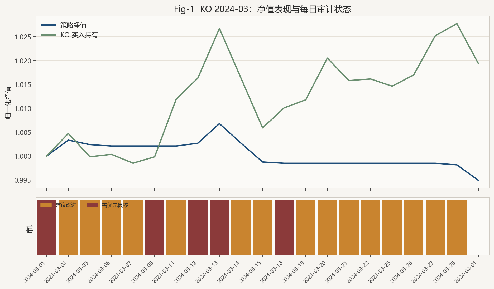
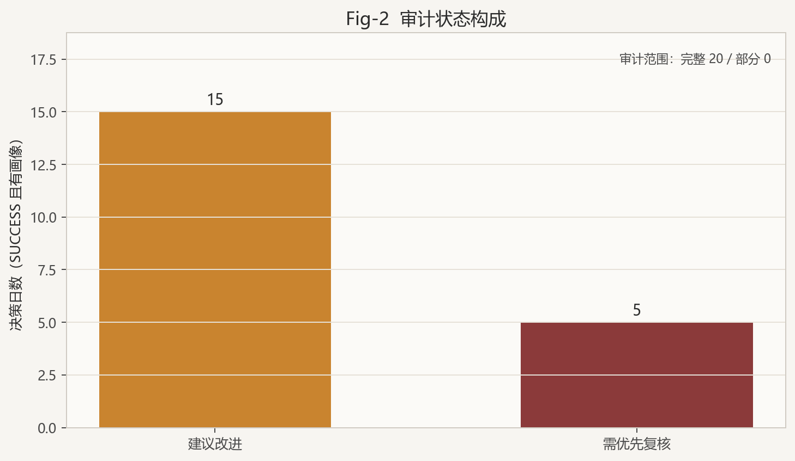
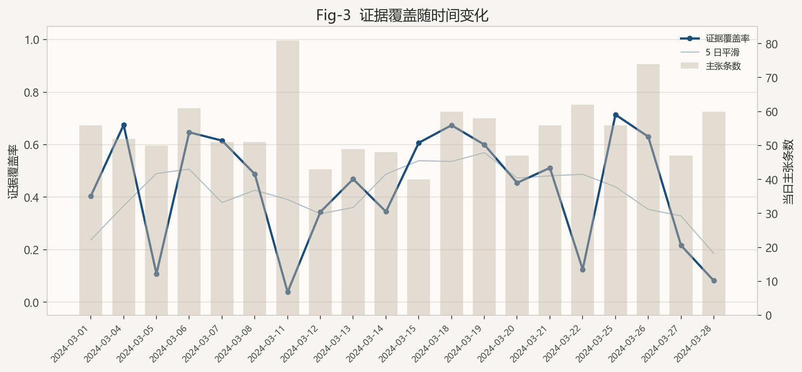
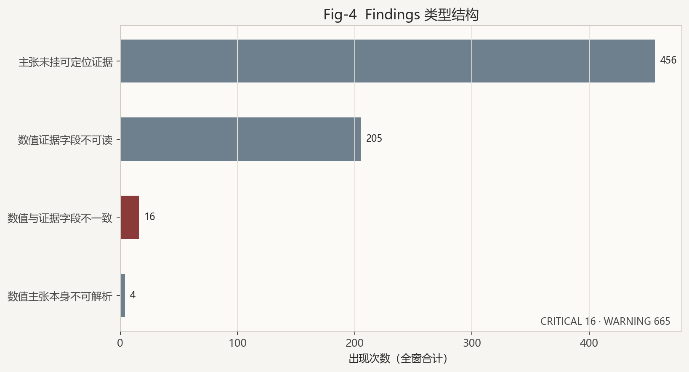
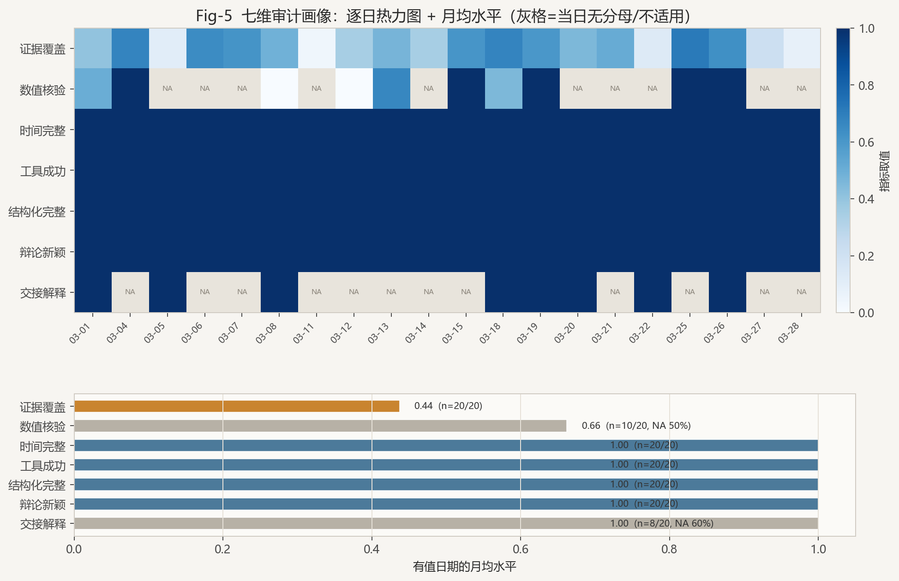
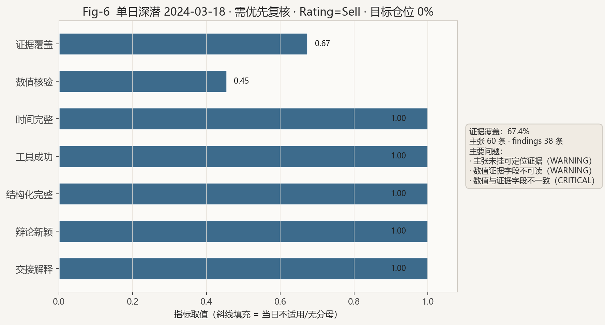

# Multi-Agent Credibility Design and Implementation Report

> TradingAgents Decision Lab · Team C  
> 对应设计规范：`docs/多智能体可信度设计方案.md`  
> 交付范围：可信度运行时能力与回放接入；概率校准留待后续

---

## 摘要

当一套多智能体交易系统已经能够稳定产出研究报告时，下一步真正困难的问题往往不是“能不能再多一个角色”，而是“读完之后还敢不敢信”。TradingAgents 的分析、辩论与决策链路已经相当完整，可完整并不自动等于可复核：一段读起来专业的收益描述未必回得了某次工具观测，一场看起来充分的多空交锋未必真的引入了新证据，而结构化失败一旦被自由文本悄悄接住，读者甚至不会察觉系统曾经降级。本报告说明我们为何把工作重心放到可信度层，以及这层能力如何改变系统的使用方式。我们并不试图用另一个更强的模型去覆盖 Portfolio Manager 的判断，而是让每次重要结论都能被追问来源、时间与一致性，并让这些追问结果在纸面回测与回放界面中持续可见；对验收而言，它的价值因此不在于又多写了多少页投资叙事，而在于把“经不起追问”从隐性风险变成可观察、可定位、可改进的对象。

---

## 一、为什么这件事值得做

项目早期最容易被高估的是报告的说服力。行情、新闻、基本面与辩论一旦被组织进同一份文本，阅读体验常常好过系统真实的证据纪律：审查者若只问“今天看多还是看空”，系统似乎已经够用，可一旦追问“这个百分之八从哪来”“这条新闻在决策日是否可得”“研究经理究竟搁置了什么反例”，原先流畅的叙述就会迅速变薄。更麻烦的是，这种变薄并不总以报错的形式出现，而更常表现为无法定位、无法比较、无法复盘，于是问题会在表面上被“写得很完整”盖住。

多智能体研究在近几年反复触及相近的不安。能力接近、训练数据接近的模型即便被赋予对立角色，仍可能共享误解并在辩论中彼此加固，而不是彼此纠正；轮次增加也不必然提高正确率，顺从与好胜都可能把过程推向错误方向。与此同时，事实核验领域越来越强调把长文本拆成可检验的主张，金融场景下的系统扰动观察则提醒人们：局部失真会沿着 Agent 链传播，若验收只盯收益曲线，很容易把文笔误认为稳健。这些讨论并不直接给出一套可粘贴的金融产品方案，却足够说明，在 TradingAgents 这种同供应商模型、高强度文本生成的系统里，如果缺少专门的证据与核验机制，所谓“多智能体交叉验证”很容易名不副实。可信度工作的必要性正是从这里逐渐明确起来的：不是为了让报告更华丽，而是为了让系统在被追问时还有东西可以交出来。

---

## 二、我们选择怎样的路线

面对上述缺口，最诱人的做法是再引入一个裁判 Agent，让它重写或否决最终评级，但我们没有走这条路。系统里已经有研究经理负责综合辩论，也有组合经理负责最终立场，再叠加一个大模型裁判既昂贵，也难证明它比前两者更少幻觉；更关键的是，裁判仍然可能在没有字段级依据时给出很有把握的评语，问题只会换一个署名重新出现。于是我们把目标改成更窄、也更硬的一组问题：系统能否在运行过程中留下可追溯的观测，能否把影响决策的句子变成可核对的主张，能否用确定性规则指出数字冲突、时间越界和来源空缺，又能不能在不改写投资结论的前提下，把这些结果披露给人和后续流程。涨跌对不对，可以交给回测与实盘去检验；这份材料经不经得起审计，才是可信度层要负责的事。

在组织方式上，我们刻意避免再长出第二条平行流水线，让采集、声明、核验与呈现共用同一份运行时事实，而不是让辩论、交接和报告各自扫描正文、各自发明告警。来源登记借鉴了 Agent 工作流 provenance 的思路，第一阶段用项目里已有的公共事件结构（`TraceEvent`）记录“何时、由谁、调用了什么”，并把工具观测标成证据类事件，做到足够支撑复核即可，而没有把完整 W3C PROV 谱系标准当作交付前提；不确定性校准相关工作提醒过“稳定共识不等于可靠信念”，这一点我们接受，却把概率分数留到将来有人工复核样本之后——在缺少标定数据时输出一个漂亮的总置信度，只会制造伪精确。执行侧是否下单仍由既有安全策略决定；最终评级仍只属于 Portfolio Manager，审计结果只写入决策信封里的诊断区（`diagnostics`），可以提示风险，却不改写 Rating，也不自行决定目标仓位。

---

## 三、工作是如何一步步变得有用的

### 从“调用过工具”到“事后还能指认那次调用”

可信度若从报告写完后再做溯源，几乎注定靠猜测。实际系统里，工具本来就不只走一条路：有的在分析师循环里按需触发，有的在情绪与新闻阶段被代码强制预取，有的出现在多空辩论的补充计算里，有的要到保存报告时才生成统计附录；这些路径原先并不共享同一种“看见了什么”的记录，下游主张即使想引用证据，也常常找不到稳定身份。我们做的第一件事，是提供统一的带证调用入口（`invoke_evidenced`）：无论工具从哪条路径触发，都会在发生当时留下一条观测——调用参数先脱敏再保存，避免密钥进入审计包；返回内容固化为可寻址的证据载荷，并区分成功、空结果与失败，从而使审查不再依赖“模型是否记得自己用过什么”，而可以回到运行期事件流本身。附录统计还暴露过一个更隐蔽的风险：保存阶段重新取数，再用新结果去核对旧正文，会让覆盖率看起来好得不真实；因此这类补算会被显式标成“运行后重算”（`post_run_recomputed`），不能拿来支撑运行时正文里的主张，纸面回测则优先复用决策当时冻结下来的统计快照，只有缺失时才允许带标记的补算。听起来像细节，却直接决定审计检查的是决策当时，还是保存时刻的巧合。没有这一层，后面所有主张核验都会缺少可依赖的基础；有了这一层，“系统用过数据”才从叙述变成可复查的事实。

### 从“整篇看起来专业”到“每一句关键话能否被点名”

长报告适合阅读，却并不适合核验，因为核验需要知道一句话究竟是数值、日期、事实、因果、预测还是观点，它声称的窗口与单位是什么，以及它指向哪一份载荷里的哪个字段。正是出于这一需要，我们把影响决策的内容收成结构化主张记录（`ClaimRecord`）：数值类尽量写明对象、关系、取值、单位与时间窗口，证据引用则指向“哪一份载荷、哪个字段”，而不是在全文里碰运气搜数字。已经具备结构化出口的节点，会在输出里附带关键主张及其证据引用；仍以长文为主的市场、新闻与基本面分析师，则通过旁路索引生成（`build_claim_sidecar`）在不另设裁判角色的前提下，把草稿编成可检索条目并写回文末。这里有一条很容易被忽略、却对诚实性至关重要的约束：从自由文本里抽出来的候选只能标成“候选、非完整覆盖”，可以提示可疑之处，不能假装已经覆盖全部关键断言；所以只要关键节点还缺少完整旁路，或结构化过程发生过不可见降级，审计范围就必须承认为部分覆盖，状态也不应再宣称全面通过。与之配套，新运行里的关键结构化出口改为严格失败可见：拿不到可用决策时，交易路径进入既有的失败保仓（`FAILED_SAFE`），保持当前仓位，而不是用一篇流畅的降级文本把问题抹平。对使用者来说，追问终于有了抓手，审查者不必在五千字里手工翻找数字，而可以从主张索引回到载荷字段；系统也被迫区分尚不能自动判定的因果叙事，与应当能对上的比率和日期。

### 从“再写一段免责声明”到“指出哪里对不上”

有了观测与主张之后，仍然需要一个不会假装理解全部金融因果的检查机制。统一核验入口（`run_verifier`）只做代码能够客观判断的事：引用的证据是否真实存在，数值是否按字段选择器在容差内一致，工具参数里的分析截止日期是否越过决策时点，以及结构化调用是否真的结构化成功；冲突会记成发现项，主张随之标成支持、冲突或未溯源，而对预测与观点宁可标明“无法由代码确定性核验”，也不用“模型觉得合理”冒充通过。呈现上由审计画像生成（`build_audit_profile`）拒绝单一可信分数，因为没有历史复核标定之前，一个百分之八十七的数字看起来专业、实质空洞；取而代之的是一组带分母的维度，例如有多少关键主张真正挂上了证据、数值主张里有多少完成了对撞、时间约束与工具调用是否健康、结构化是否完整、辩论是否带来新证据、交接改变是否附带解释，并同时保留适用、支持、失败、排除与未知计数，避免分母为零时偷偷记满分。状态旁还会给出改进建议，告诉人优先补哪类缺口，同时又明确这些建议不影响既有评级权威。当团队第一次在真实样例里看到“正文数字与证据字段对不上”这类冲突被稳定抓出时，可信度层才不再只是设计文档里的愿望，而变成能够打断过度自信的机制，也把原先说不清的不安转成了可以继续处理的信息。

### 辩论与工具：让“反对”真正消耗新证据

多空辩论在产品叙事里常被写成交叉验证，可若双方反复复述同一组观察，反对就只剩下语气。我们为每一轮写入辩论轮次记录（`DebateTurnRecord`），标明本轮针对哪条主张、补充了哪些证据、做了何种纠正，并在完整周期没有新增证据或实质性纠正时允许提前结束，目的不是缩短热闹程度，而是减少空转；交接处则留下决策快照，说明相对上游是采纳、修改还是暂不可比，以及改变理由指向何处。我们刻意不做的一件事，是把不同语义的评级语言强行折成同一条多空轴，因为在缺少仓位语境时，那种折算本身就会制造新的误报，反过来伤害审查信任。与此同时，我们补强了分析与辩论所需的确定性工具：市场侧可计算多窗口价量、量能异常与跳空，情绪侧用词典打分保证同类输入下结果可复现，多空两侧只保留相对基准表现与回撤恢复统计这两类上游未覆盖的能力，并在整次运行中限制各工具至多调用一次，避免辩论研究者把分析师的工作再做一遍。这些工具的意义，不在于让报告多几张“量化标签”，而在于给主张核验提供稳定原料；没有可寻址的数字载荷，主张编号再整齐，也难以支撑真正的复核。

### 进入日常流程之后，它才真正改变使用方式

若审计结果只在偶尔导出的文件夹里出现，它很难进入团队的真实工作节奏。保存报告时，审计写入流程会生成事件流、主张索引、发现项、机器可读画像、清单文件，以及可由画像再生的人读说明；与此同时，我们把同一套投影接到纸面交易成功路径与回放界面，使一次决策结束后，诊断区里能够看到审计画像、发现项、辩论轮次摘要，以及记忆溯源信息——只保留记忆编号、决策时间、可用时间与相关度，不复制敏感正文。即便投影自身失败，也只记录审计异常并保留原始交易意图，从而避免可信度层反客为主，把研究系统变成“验不通过就不许说话”的闸门。回放页上的“可信度建议”进一步让审查可以按日翻看哪些日子证据薄弱、哪些日子出现硬冲突、失败保仓日为何没有完整画像，旧回测也能在不改归档的前提下只读重建视图，新回测则直接持久化；至此，可信度从一次性报告附件变成了复盘决策时默认会碰到的一层信息，也因此比再看一份设计图更能说明它已经进入产品使用路径，而不只是停留在说明文字里。

---

## 四、与相关工作的距离

相关工作给我们的，更多是问题意识，而不是一张可同名移植的模块清单。辩论可靠性研究让人很难再把“大家都同意”当成验证，主张级事实核验说明长文评分解决不了定位问题，工作流 provenance 强调证据应在产生时留下而不是事后回忆，金融 Agent 的扰动观察则把“能不能检出错误”本身变成验收对象；不确定性与校准方向同样有启发，但我们暂时不引入总概率分数，因为在缺少人工复核样本时，那样做很容易把尚未成立的把握包装成精致数字。本项目也没有跟进这些工作里某些诱人的分支：既没有训练专门的仲裁模型，也没有宣称工具包装上的差异已经等同于证据独立，更没有在缺少人工标签时上线置信阈值；收益率、回撤与审计指标被并行保留，使得赚钱与否可以讨论策略却不能用来证明审计层成功，审计通过与否可以讨论材料是否完整却不能用来证明明天会上涨。

---

## 五、它在实践中表现出的必要性

回归测试盯住的，是最容易自我美化的角落：带证调用是否可重复登记且不含密钥，评级解析是否还会在失败时悄悄落成中性，数值核对是否真的回到字段而不是全文搜索，事后重算的证据是否还能冒充运行时支持，审计过程会不会改写组合经理原文，辩论是否会在没有新信息时空转，回放能否展示分母与未知量，旧诊断能否只读重建。端到端运行则表明，完整链路能够沉淀大量可追溯观测，并在真实报告中暴露字段级不一致；连接抖动导致的失败会进入既有失败保仓路径，而不会被审计逻辑改写成另一种投资观点。

纸面回测里更常见的画面，或许更能说明这层能力为什么有用。成功日往往留下深浅不一的审计状态——通过、建议改进、或需优先复核——许多时候并不是“全部通过”，而是证据覆盖不足、主张未挂来源，或正文数字与证据字段冲突；若把这些结果理解成系统坏了，会完全读错方向，因为它们恰恰说明审查终于看见了原先被流畅文本盖住的薄弱处。失败保仓日只有最小错误说明，也符合没有完整图状态就不应假装完成主张级审计的常理。对使用者而言，这意味着复盘时多了一类以前无法稳定提出的问题：不再只问盈亏，还要问材料是否配得上那个评级。以 KO 2024-03 窗纸面回测为例的完整数字、图示与单日深潜，见文末附录 B。

---

## 六、仍需坦白的限度

主张结构可以先就绪，模型是否认真挂上证据引用、是否真正点名主张标识，却仍决定填充质量；部分分析师长文还可以继续收紧出口形式，系统级压力场景与概率校准也还未作为默认能力交付。来源记录证明的是“当时记下了什么”，而不是上游世界本身为真；审计通过证明的是完整性检查走完且未击中致命冲突，而不是投资建议正确；在同一类模型上强化证据多样性，也还不等于获得了真正的模型异质。我们把这些限度写进报告，是因为可信度工作最容易在下一阶段走偏——要么急着输出总分，要么再加角色去掩盖引用率不足——而更有价值的继续推进，仍然是让更多关键句子真正指向具体证据字段，让注入错误时的检出更稳，并在积累人工复核之后再谈校准。

---

## 七、结语

TradingAgents 原本就擅长把多方分析组织成一份像样的决策材料，而我们完成的工作，是让这份材料在被追问时不再只能依靠措辞支撑——运行中的调用能够被指认，影响决策的主张能够被点名，对不上的地方能够被指出，缺少新证据的辩论空转能够被限制，披露能够进入日常回放，最终评级却仍然归于组合经理；与此相应，新增的确定性工具为这条链提供可核对的原料，纸面交易与回放接入则保证它不只存在于设计说明里。如果一项多智能体能力值得被认真验收，它至少应当改变人们复盘时会问什么，而可信度层的意义正在于此：它使“有用”不再只等于“会写报告”，而等于“经得起下一问”。

---

## 参考文献

Estornell, A., & Liu, Y. (2024). Multi-LLM Debate: Framework, Principals, and Interventions. NeurIPS 2024.  
https://proceedings.neurips.cc/paper_files/paper/2024/file/32e07a110c6c6acf1afbf2bf82b614ad-Paper-Conference.pdf

Talk Isn’t Always Cheap: Understanding Failure Modes in Multi-Agent Debate. ICML 2025 Multi-Agent Systems workshop. arXiv:2509.05396.

When and Why Does Multi-Agent Debate Fail and Does It Really Underperform? arXiv:2510.20963.

Debating Truth: Debate-driven Claim Verification with Multiple Large Language Model Agents. WWW 2026. arXiv:2507.19090.

MAD-Fact: A Multi-Agent Debate Framework for Long-Form Factuality Evaluation in LLMs. Frontiers of Computer Science, 2025. arXiv:2510.22967.

Tool-MAD: A Multi-Agent Debate Framework for Fact Verification with Diverse Tool Augmentation and Adaptive Retrieval. arXiv:2601.04742.

PROV-AGENT: Unified Provenance for Tracking AI Agent Interactions in Agentic Workflows. IEEE e-Science 2025. arXiv:2508.02866.

FINCON: A Synthesized LLM Multi-Agent System with Conceptual Verbal Reinforcement for Enhanced Financial Decision Making. NeurIPS 2024.

TradeTrap: Are LLM-based Trading Agents Truly Reliable and Faithful? arXiv:2512.02261.

Rethinking LLM Uncertainty: A Multi-Agent Approach to Estimating Black-Box Model Uncertainty. Findings of EMNLP 2025.

Belief-Calibrated Multi-Agent Consensus Seeking for Complex NLP Tasks. NeurIPS 2025.

---

## 附录 A：实现位置（供对照，非正式正文）

可信度核心位于 `tradingagents/extensions/decision/credibility/`；确定性分析与辩论工具位于 `tradingagents/extensions/decision/tools/`；结构化旁路与报告写入分布于 agents 工具层及 reporting 相关模块；纸面诊断与回放接入分别在 paper trading 集成与 `webui/pages/replay.py`；定向测试见 `tests/TEAM_C/test_credibility.py` 与 `tests/test_replay_credibility.py`。

---

## 附录 B：KO 2024-03 

### 图表与表

**Table-A 跑次摘要**

| 项目 | 数值 |
|------|------|
| 跑次 | `DATA2-KO-MARCH`（`8d06aa83…`） |
| 窗口 | 2024-03-01 → 2024-04-01 |
| 决策日 | 20（全部 SUCCESS） |
| 策略收益 / KO 买入持有 / Alpha | −0.51% / +1.93% / −2.44% |
| 最大回撤 / 换手 / 费用 | −1.18% / 2.00 / $99.94 |
| 画像覆盖 | 20/20 |
| 审计状态 | 建议改进 15 · 需复核 5 · 通过 0 |
| 证据覆盖均值 | 43.7% |
| Findings | CRITICAL 16 · WARNING 665 |

**Table-B 主样例日（2024-03-18）**

| 项目 | 数值 |
|------|------|
| Rating / 目标仓位 | Sell / 0% |
| 审计状态 / 范围 | 需优先复核 / FULL |
| 证据覆盖 | 67.4% |
| 结构化完整 / 工具成功 | 1.0 / 1.0 |
| 主张 / findings | 60 / 38 |
| 代表问题 | 主张未挂可定位证据；数值证据字段不可读；数值与证据字段不一致（CRITICAL） |

