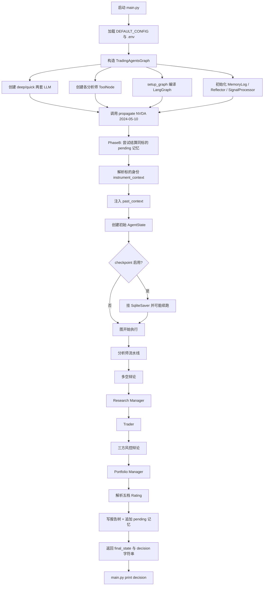
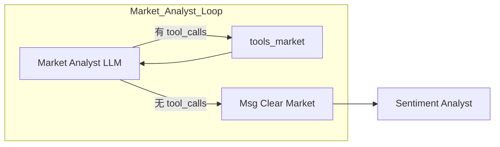
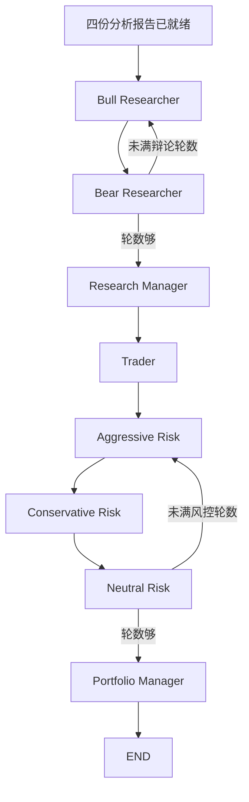
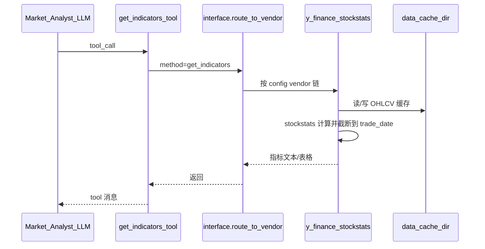

# TradingAgents 一次完整执行流程图

本文用自然语言 + 流程图，**模拟一次程序执行**（以 `main.py` 调用 `TradingAgentsGraph.propagate("NVDA", "2024-05-10")` 为例）。不含 CLI 交互界面细节；CLI 在选好参数后进入的图执行路径与此一致。

---

## 1. 总览：从启动到打印决策

---

## 2. 初始化阶段（构造 `TradingAgentsGraph` 时）

用自然语言逐步说明：

1. **读配置**：`DEFAULT_CONFIG` 已根据环境变量改写过 LLM 提供商、模型、辩论轮数、数据 vendor 等。  
2. **`set_config`**：把同一份配置交给 dataflows，保证 Tool 拉数时用同一缓存目录与 vendor 链。  
3. **建目录**：确保缓存目录、结果目录存在。  
4. **建 LLM**：`create_llm_client` 按 provider 生成「深度思考」与「快速思考」两个聊天模型；分析师/研究员多用 quick，经理级多用 deep。  
5. **建 Tool 节点**：市场、情绪、新闻、基本面四组 `ToolNode`，分别挂载对应 `@tool`（行情、指标、新闻、宏观、财报等）。  
6. **拼图**：`GraphSetup.setup_graph` 按默认分析师顺序（market → social/sentiment → news → fundamentals）加节点与边，再接辩论与经理链，最后 `compile()`。  
7. **附属组件**：记忆日志路径、反射器（事后总结）、信号处理器（从长文抽 Rating）。

此时图已就绪，但**尚未**对任何股票推理。

---

## 3. `propagate` 入口：记忆与上下文准备

假设调用：`ta.propagate("NVDA", "2024-05-10")`。

### 3.1 Phase B：结算旧决策（若有）

1. 打开记忆日志，找出 **同一 ticker、状态为 pending** 的历史条目。  
2. 用 yfinance 拉取该决策日之后若干交易日的价格，以及基准（美股默认 SPY）。  
3. 算出 raw return 与 alpha；若数据尚不可用（日期太近），则跳过留待下次。  
4. 对可结算条目，调用 `Reflector` 生成短反思，原子写回日志（pending → 已结算 + REFLECTION）。  

这样，**本次**分析开始前，记忆库尽量已更新为「带教训」的状态。

### 3.2 标的身份与历史上下文

1. `resolve_instrument_identity`：确定性查公司名称等信息，减少模型「看图乱认公司」。  
2. `build_instrument_context`：拼成固定上下文字符串。  
3. `get_past_context("NVDA")`：取同标的近期已结算决策全文 + 若干跨标的教训摘要。  
4. `Propagator.create_initial_state`：填入公司、日期、空报告字段、空辩论状态、`past_context`、`instrument_context` 等。

### 3.3 Checkpoint（可选）

若配置打开 checkpoint：为该 ticker 打开 SQLite saver，用「分析师集合 + 辩论深度 + 资产类型」签名生成 thread；若上次中断则可从某 step 续跑，否则全新开始。

---

## 4. 图内执行：分析师流水线（详细）

默认四个分析师**串行**。以市场分析师为例，其余结构相同。

**单次市场分析循环（自然语言）：**

1. 节点读到 state：交易日、instrument 上下文、past_context。  
2. LLM 按系统提示选择若干技术指标，并决定调用 `get_stock_data`、`get_indicators`、`get_verified_market_snapshot` 等。  
3. 条件边发现 `tool_calls` → 进入 `tools_market`：ToolNode 真实执行 → 走 `interface.route_to_vendor` → 例如 yfinance + stockstats 算 RSI/MACD，并按 `2024-05-10` **截断未来数据**。  
4. 工具结果回到消息列表，LLM 继续；可能再调工具，也可能写完分析。  
5. 无 tool_calls 时进入「Msg Clear」：清掉冗长 tool 对话，只保留已写入的 `market_report`，再进入下一分析师。

随后 **Sentiment / News / Fundamentals** 各自完成「LLM ↔ Tool」循环，分别写入 `sentiment_report`、`news_report`、`fundamentals_report`。新闻分析师还可能拉 FRED、Polymarket；情绪侧可能触及新闻/社媒数据源。

---

## 5. 图内执行：研究 → 交易 → 风控 → 终裁

**自然语言细节：**

1. **Bull**：阅读四份报告与 `past_context`，写多头论点，更新 `investment_debate_state`（历史、当前发言、计数）。  
2. **Bear**：针对多头与报告写空头论点。  
3. 条件逻辑按 `max_debate_rounds` 在 Bull/Bear 间切换；满轮后交给 **Research Manager**。  
4. **Research Manager**（deep LLM + 结构化输出）：产出投资计划 `investment_plan`（含推荐档位与行动建议）。  
5. **Trader**：把计划变成交易提案 `trader_investment_plan`（Buy/Hold/Sell 向）。  
6. **Aggressive / Conservative / Neutral**：围绕交易提案辩论风险偏好，更新 `risk_debate_state`；满 `max_risk_discuss_rounds` 后交给组合经理。  
7. **Portfolio Manager**：综合风控辩论，写出带 `**Rating**: ...` 的最终决策 `final_trade_decision`，图到达 END。

---

## 6. 图结束后：信号处理、落盘、记忆

1. **SignalProcessor**：从 `final_trade_decision` 文本解析五档之一（如 `Buy`），无需再调 LLM。  
2. **写报告**：`write_report_tree` 在结果目录下按「分析师 / 研究 / 交易 / 风控 / 组合」分层保存 markdown，并生成总报告。  
3. **记忆 Phase A**：`store_decision` 向记忆日志追加一条 `[日期 | NVDA | Rating | pending]` + DECISION 正文。  
4. **返回**：`(final_state, decision)`；`main.py` 打印 `decision`。

至此，**这一次**前向分析结束。真正的「对错反思」要等持有期过后，在**下一次**同标的 `propagate` 开头的 Phase B 完成。

---

## 7. 数据在一次 tool 调用中的路径（横切）

以 `get_indicators("NVDA", "rsi", "2024-05-10")` 为例：

要点：Agent **不**直接写死 yfinance；路由与错误类型由 dataflows 统一处理。

---

## 8. 一次运行的「信息流」摘要（便于对照代码）

| 阶段 | 主要写入的 state 字段 | 主要读入 |
|------|----------------------|----------|
| 初始 | messages, company, date, past_context, instrument_context | 配置、记忆日志 |
| 分析师 | market/sentiment/news/fundamentals_report | tools 返回的数据 |
| 多空 | investment_debate_state | 四份报告 |
| 研究经理 | investment_plan | 辩论状态 |
| 交易员 | trader_investment_plan | investment_plan |
| 风控 | risk_debate_state | 交易计划与报告 |
| 组合经理 | final_trade_decision | 风控辩论 |
| 图后 | （磁盘）报告 + 记忆 pending | final_state |

---

## 9. 与「仅 LLM 辩论」相关的边界

整条流水线中，**方向性决策与辩论几乎全是 LLM**；确定性部分主要是：

- 行情/指标/财报拉取与日期截断；  
- 市场快照校验；  
- Rating 字符串解析；  
- 记忆日志的读写与 pending 结算用的收益算术。

当前不再在组合经理之后接量化硬闸门。工具与报告扩展见 `扩展方案.md`；
证据追踪、主张核验和审计状态的目标架构见 `多智能体可信度设计方案.md`。
